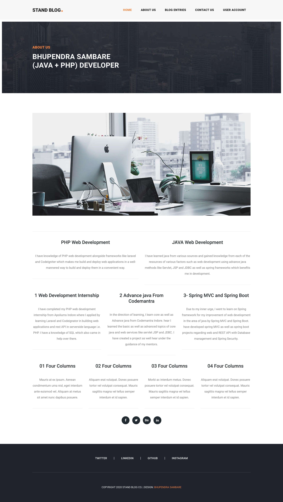
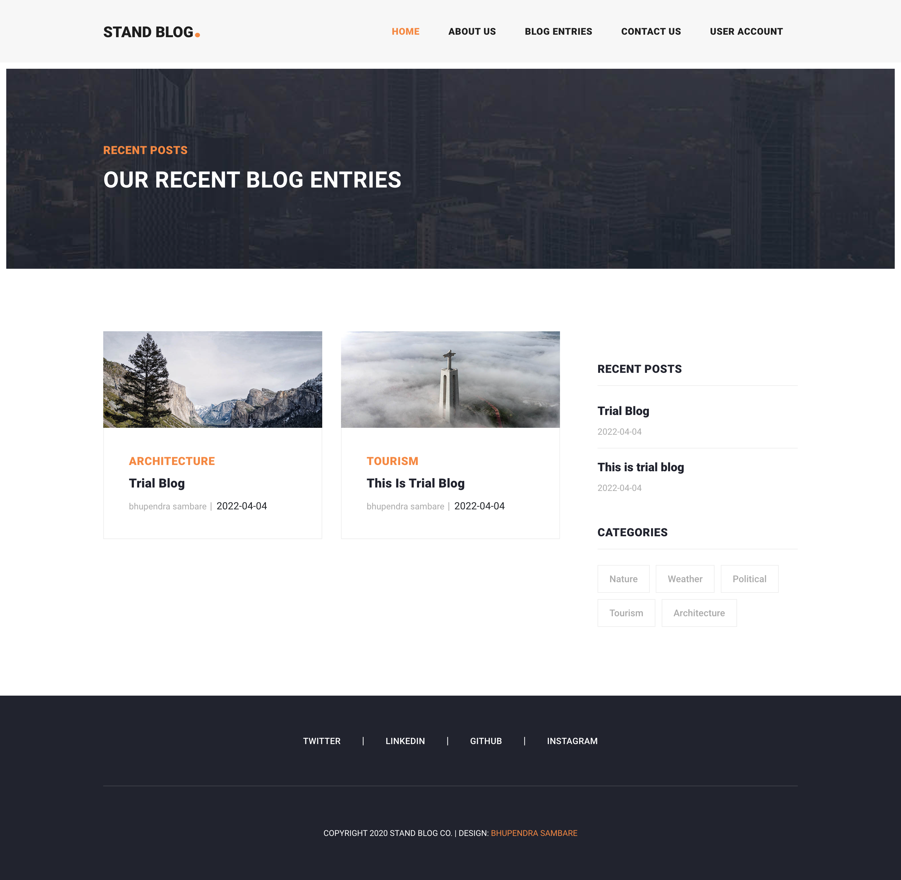
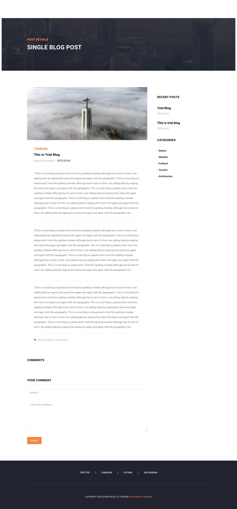
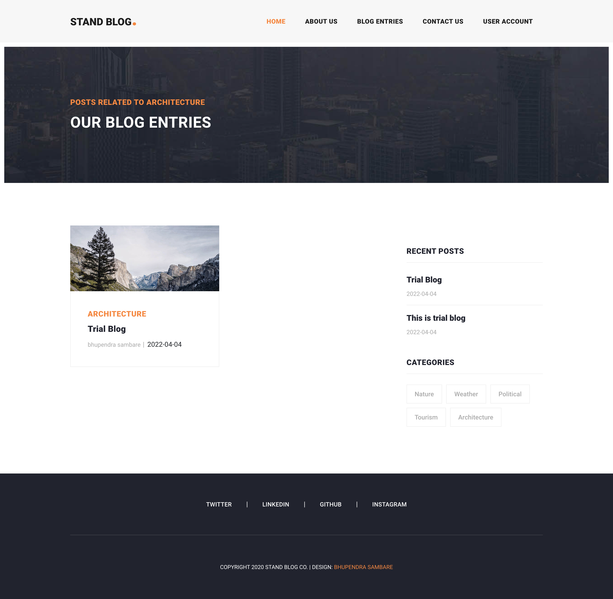
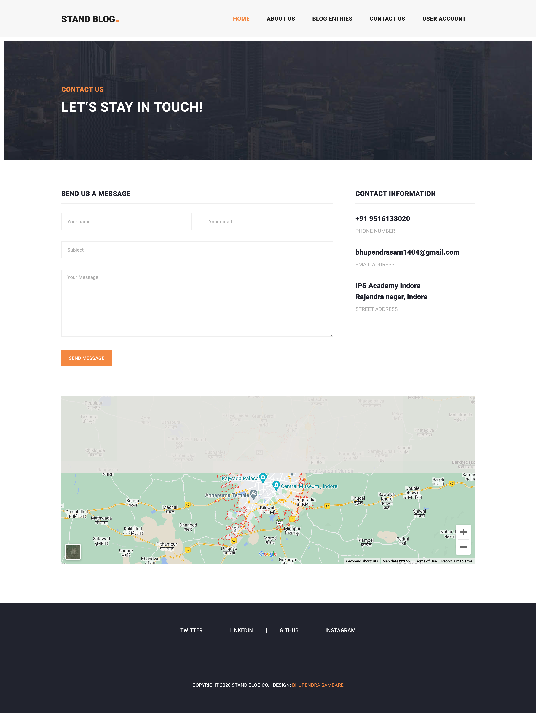
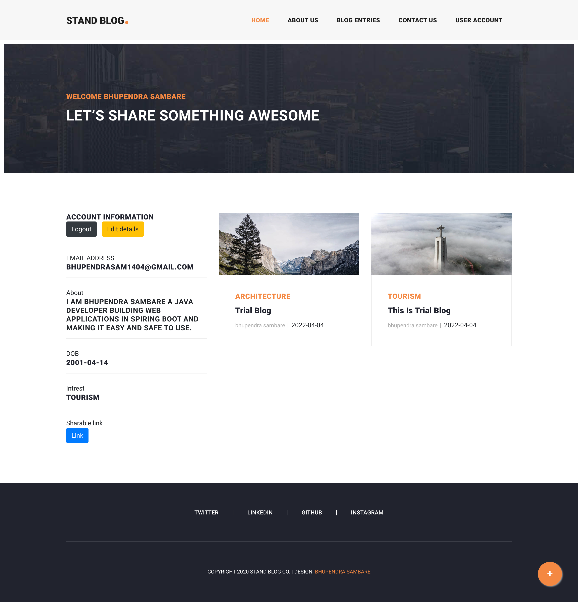

# Spring Boot Blog Minor Project
## Based on Spring Boot and Hibernate

Spring boot blog is a multi-user person-to-person mode ot content sharing platform where every person has a platform for sharing their thoughts on different topics and areas of interest. People can share their thought, images, ideas and memory through which they want to interact with socity and give away information regarding the topics.

## Features

- String Boot
- Hibernate
- H2 - Databse
- Thymeleaf
- File management
- Java environmet

## The goal behing was followed -

> Applying java Spring boot
> 
> Hibernate Query Management
> 
> Database Management
> 
> File Management
> 
> User To User Communication

## Requirements:
* apache maven 3.8.4

* java jdk 8 or 8+

## Start project

> Unzip the project
>
> Locate the folder in cmd/terminal
>
>run mvn spring-boot:run

### Important linkes: {H2- database}

> http://localhost:8080/h2-console [user:bhupendra password:password]
> 
## Screenshots

> </img>

> </img>

> </img>

> </img>

> </img>

> </img>

> </img>
